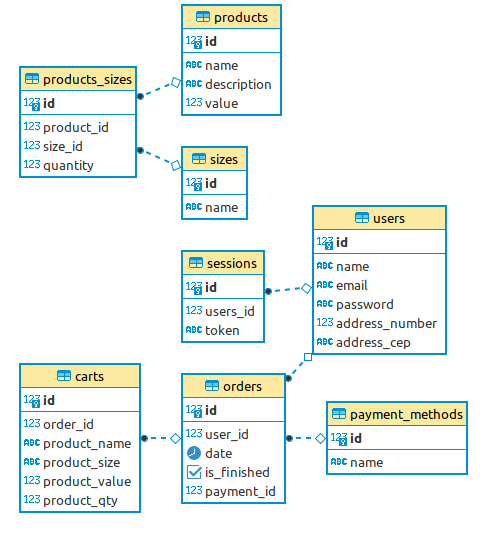

<h1 align="center">
   🛍️ <a href="#"> Atelie API </a>
</h1>

<h3 align="center">
    Your best dress shop
</h3>

<h4 align="center"> 
	 Status: Finished
</h4>

<p align="center">
 <a href="#about">About</a> •
 <a href="#database-layout">Database Layout</a> • 
 <a href="#how-it-works">How it works</a> • 
 <a href="#pre-requisites">Pre-requisites</a> • 
 <a href="#tech-stack">Tech Stack</a> • 
 <a href="#how-to-contribute">How to contribute</a> • 
 <a href="#author">Author</a>
</p>

## About

Aiming to make you more elegant and safe, Atelie provides exclusive clothes for your look. You can browse our website and see all the products, which have pieces from sizes P to G. Seeking to ensure a good experience, when you complete your purchase, you will receive an email with all information about the products and payment method selected.

---

## Database Layout

<h1 align="center">

</h1>

The database was designed at https://www.dbdesigner.net/ for PostgreSQL.

```postgresql

/* In your psql terminal */
CREATE DATABASE atelie;

/* Access the database */
\c atelie

```

Now, just run the commands listed in <a href="https://github.com/samuelfcf/atelie-backend/blob/main/dump.sql">dump.sql</a>

---

## How it works

This project is divided into two parts:

1. Backend (This repository)
2. Frontend (You can find here: https://github.com/okitauehara/atelie-front)

---

## Pre-requisites

Before starting, you will need to have an email address set up on the [SendGrid](https://sendgrid.com/) site and the following tools installed on your machine:
[Git](https://git-scm.com), [Node.js](https://nodejs.org/en/), [VSCode](https://code.visualstudio.com/).

### Running the Backend (server)

```bash

# Clone this repository
$ git clone https://github.com/samuelfcf/atelie-backend

# Access the project folder cmd/terminal
$ cd gratibox-api

# Install the dependencies
$ npm install

# Create a .env.dev file and fill it using your environment variables following the .env.example

# Run the application in development mode
$ ntl -> start:dev

# The server will start at port: 4000

```

You can find the .env.example <a href="https://github.com/samuelfcf/atelie-backend/blob/main/.env.exemple">here</a>

---

## Tech Stack

The following tools were used in the construction of the project-api:

**Server** ([NodeJS](https://nodejs.org/en/))

- **[Express](https://expressjs.com/)**
- **[CORS](https://expressjs.com/en/resources/middleware/cors.html)**
- **[Bcrypt](https://github.com/kelektiv/node.bcrypt.js)**
- **[NTL](https://github.com/ruyadorno/ntl)**
- **[Pg](https://github.com/brianc/node-postgres)**
- **[DotENV](https://github.com/motdotla/dotenv)**
- **[UUID](https://github.com/uuidjs/uuid)**
- **[Faker](https://github.com/Marak/Faker.js)**
- **[SendGrid](https://github.com/sendgrid/sendgrid-nodejs)**
- **[Joi](https://github.com/hapijs/joi)**
- **[Husky](https://github.com/typicode/husky)**
- **[Jest](https://github.com/facebook/jest)**
- **[Supertest](https://github.com/visionmedia/supertest)**
- **[Eslint - Airbnb](https://github.com/airbnb/javascript)**
- **[Prettier](https://github.com/prettier/prettier)**

> See the file [package.json](https://github.com/samuelfcf/gratibox-back/blob/main/package.json)

**Utilitários**

- Editor: **[Visual Studio Code](https://code.visualstudio.com/)**
- API Test: **[Insomnia](https://insomnia.rest/)**, **[Thunder Client](https://www.thunderclient.io/)**

---

## How to contribute

1. Fork the project.
2. Create a new branch with your changes: `git checkout -b feat/myFeatureName`
3. For each feature implemented, make a commit specifying what was done
4. Submit your changes: `git push -u origin feat/myFeatureName`

---

## Author

Developed by Marcos Okita Uehara and Samuel Felipe Castro Fernandes.
